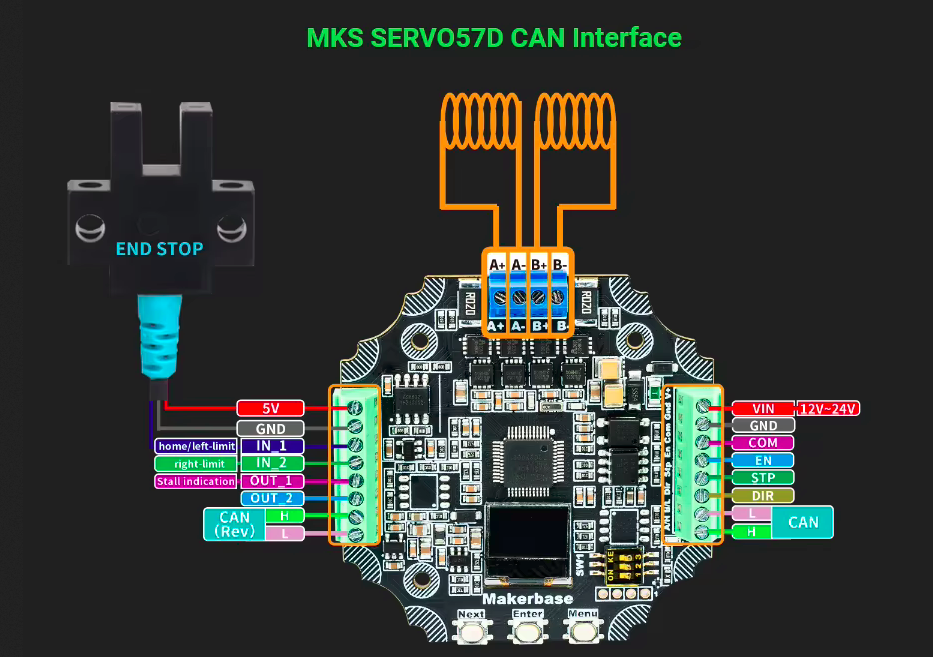
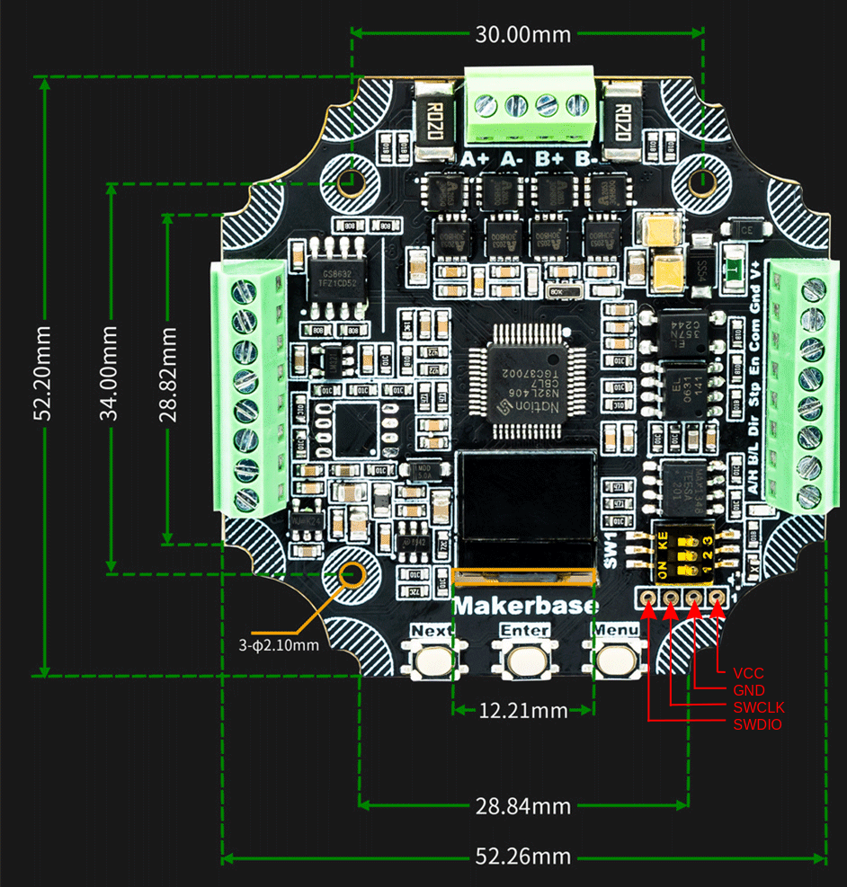

# servo57d
Firmware for MKS Servo57D

## Programming interface

## Unlock N32L40x

To unlock - use ["NationsMCUDownloadTool.7z"](bin/NationsMCUDownloadTool.7z). Set encryption level to L0 for FW upload

## Supporting the Project

If this project resonates with you, please consider the following ways to support its development:

- **[BuyMeaCoffee](https://buymeacoffee.com/delsian):** Preferred for membership subscription and one-time donation
- **[Patreon](https://patreon.com/EugK):** Alternative platform with higher fees